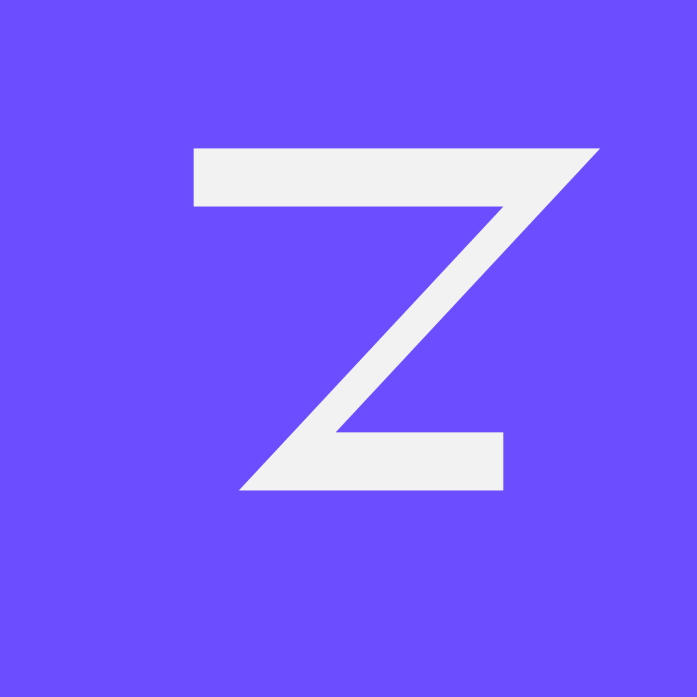

<p align="center">
  
</p>

<h1 align="center">Zorn</h1>

<p align="center">Fuente de sideload (AltStore / SideStore) para mis apps personales.</p>

---

## Añadir la fuente

Copia esta URL en **AltStore** o **SideStore** → *Browse* → *Sources* → **+**:

```
https://raw.githubusercontent.com/sebastianov92/Zorn/main/apps.json
```

## Apps

| App | Bundle ID | Estado |
|-----|-----------|--------|
| Placeholder | `com.zorn.placeholder` | ejemplo — reemplázalo |

## Añadir una app

1. Copia el bloque `Placeholder` en `sources.json` y ajusta:
   - `name`, `bundleIdentifier`, `subtitle`, `localizedDescription`.
   - `repo` (`usuario/repo` de la app), `tagPrefix` (`miapp-`).
   - `iconURL` → sube el ícono a `apps/<app>/icon.png`.
2. Borra el bloque placeholder cuando tengas apps reales.
3. Publica el `.ipa` como asset en un **GitHub Release** del repo de la app
   (tag `miapp-1.0.0`). El Action regenera `apps.json` solo (cada 5 min o al push).

> `apps.json` se **autogenera** — no lo edites a mano. Edita `sources.json`.

## Zorn vs Dezik

Zorn es mi fuente personal. Las apps de marca Dezik viven en el repo
[`Dezik`](https://github.com/sebastianov92/Dezik). Misma maquinaria, dos fuentes.

## Setup del repo

Reemplaza `sebastianov92` por tu usuario/org de GitHub si difiere:

```bash
grep -rl sebastianov92 . | xargs sed -i '' 's/sebastianov92/tu-usuario/g'
```

Sustituye `assets/icon.png` por tu logo (512×512).

## Estructura

```
Zorn/
├── sources.json                 # config editable a mano
├── apps.json                    # AltStore Source v2, AUTOGENERADO
├── scripts/build-source.mjs     # lee releases -> apps.json
├── .github/workflows/           # Action que regenera apps.json
├── assets/icon.png              # logo, 512×512
└── apps/<app>/icon.png          # íconos/capturas por app
```
